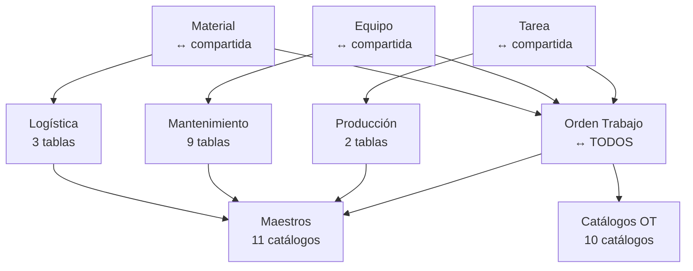

# Arquitectura de Módulos ERP - Monasterio

**Fecha de actualización:** 10 de febrero de 2026  
**Versión:** 3.0.0  
**Status:** ✅ Arquitectura Definida

---

## 📊 Estructura de 5 Áreas Principales

Este ERP está organizado en **5 módulos principales** con un total de **36 tablas**:

### 1. 📋 **OT / Dashboard** (11 tablas) — Núcleo del ERP

**Tabla principal compartida:**
- `orden_trabajo` ↔ **compartida con todos los módulos**

**10 Catálogos OT:**
- `ot_status` - Estado de la orden
- `recursos_status` - Estado de recursos
- `taller_status` - Estado del taller
- `tipo_garantia` - Tipos de garantía
- `garantia` - Garantías aplicables
- `tipo_reparacion` - Tipos de reparación
- `atencion_reparacion` - Atención en reparaciones
- `prioridad_atencion` - Prioridades
- `estrategia_ot` - Estrategias para OT
- `base_metalica` - Bases metálicas

**Endpoints API:**
```
GET    /api/ots
GET    /api/ots/:id
POST   /api/ots
PUT    /api/ots/:id
DELETE /api/ots/:id

+ 10 endpoints de catálogos en /api/catalogos/[nombre-catalogo]
```

---

### 2. 📦 **Logística** (3 tablas) — Stock, Precios, Tiempos de Entrega

**Tablas:**
- `material` ↔ **compartida** - Materiales del inventario
- `servicio` - Servicios logísticos
- `flota_equipo` ↔ **compartida** - Equipos de flota

**Endpoints API:**
```
GET    /api/materiales
GET    /api/materiales/:id
POST   /api/materiales
PUT    /api/materiales/:id
DELETE /api/materiales/:id
```

**Navegación:**
- Material (tabla compartida)
- Servicio
- Flota Equipo (tabla compartida)

---

### 3. 🔧 **Mantenimiento** (9 tablas) — Equipos, Herramientas y Estrategias

**Equipos y Componentes:**
- `equipo` ↔ **compartida** - Equipos principales
- `componente` - Componentes de equipos
- `equipo_flota` - Relación equipo-flota

**Catálogos de Equipos:**
- `tipo_equipo` - Tipos de equipo
- `tipo_componente` - Tipos de componente
- `status_equipo` - Estados de equipos

**Estrategias:**
- `estrategia` - Estrategias de mantenimiento
- `tipo_estrategia` - Tipos de estrategia
- `status_estrategia` - Estados de estrategias

**Endpoints API:**
```
GET    /api/equipos
GET    /api/equipos/:id
POST   /api/equipos
PUT    /api/equipos/:id
DELETE /api/equipos/:id

GET    /api/estrategias
GET    /api/estrategias/:id
POST   /api/estrategias
PUT    /api/estrategias/:id
DELETE /api/estrategias/:id

+ 6 endpoints de catálogos en /api/catalogos/
```

**Navegación organizada en 3 secciones:**
1. **Equipos y Componentes** (3 tablas principales)
2. **Catálogos Equipos** (3 catálogos)
3. **Estrategias** (3 tablas)

---

### 4. 🏭 **Producción** (2 tablas) — Reparaciones y Task Lists

**Tablas:**
- `registro_reparacion` - Códigos de reparación (Cod Rep)
- `tarea` ↔ **compartida** - Task lists de tareas

**Endpoints API:**
```
GET    /api/cod-rep
GET    /api/cod-rep/:id
POST   /api/cod-rep
PUT    /api/cod-rep/:id
DELETE /api/cod-rep/:id

GET    /api/tareas
GET    /api/tareas/:id
GET    /api/tareas/ot/:ot_id   <-- Obtener tareas por Orden de Trabajo
POST   /api/tareas
PUT    /api/tareas/:id
DELETE /api/tareas/:id
```

**Navegación:**
- Registro Reparación (Cod Rep)
- Tarea (tabla compartida, task lists)

---

### 5. ⚙️ **Generales / Maestros** (11 tablas) — Catálogos Globales

**Catálogos consumidos por todos los módulos:**
- `planta` - Plantas de producción
- `area` - Áreas de trabajo
- `subarea` - Subáreas
- `categoria` - Categorías de clasificación
- `clasificacion` - Clasificaciones
- `unidad_medida` - Unidades de medida
- `moneda` - Monedas
- `fabricante` - Fabricantes
- `criticidad` - Niveles de criticidad
- `posicion` - Posiciones
- `cliente` - Clientes

**Endpoints API:**
```
GET /api/catalogos/plantas
GET /api/catalogos/plantas/:codigo

GET /api/catalogos/areas
GET /api/catalogos/areas/:codigo

... (22 endpoints total: 11 × 2)
```

**Navegación:**
- 11 catálogos en dropdown único con scroll
- Todos accesibles vía `/api/catalogos/[nombre-catalogo]`

---

## 🔗 Tablas Compartidas (↔)

Estas 4 tablas son los **puentes clave** que cruzan módulos:

1. **`orden_trabajo`** (OT) - Compartida con **TODOS**
   - Núcleo central del ERP
   - Relaciona todos los módulos

2. **`material`** (Logística) - Compartida con **Producción y Mantenimiento**
   - Inventario de materiales
   - Usado en OTs, reparaciones y tareas

3. **`equipo`** (Mantenimiento) - Compartida con **Logística y Producción**
   - Equipos de mantenimiento
   - Relacionado con flota y reparaciones

4. **`tarea`** (Producción) - Compartida con **Logística y OT**
   - Task lists
   - Vinculadas a OTs y materiales

---

## 📂 Estructura de Rutas API

```
/api
├── /ots                      # Órdenes de Trabajo (núcleo)
├── /materiales               # Logística - Material
├── /equipos                  # Mantenimiento - Equipo
├── /estrategias              # Mantenimiento - Estrategia
├── /cod-rep                  # Producción - Códigos Reparación
├── /tareas                   # Producción - Tareas
│   └── /ot/:ot_id           # Tareas por OT
└── /catalogos
    ├── /plantas             # Maestros
    ├── /areas               # Maestros
    ├── /subareas            # Maestros
    ├── /categorias          # Maestros
    ├── /clasificaciones     # Maestros
    ├── /unidades-medida     # Maestros
    ├── /monedas             # Maestros
    ├── /fabricantes         # Maestros
    ├── /criticidad          # Maestros
    ├── /posiciones          # Maestros
    ├── /clientes            # Maestros
    ├── /tipo-equipo         # Mantenimiento
    ├── /tipo-componente     # Mantenimiento
    ├── /status-equipo       # Mantenimiento
    ├── /tipo-estrategia     # Mantenimiento
    ├── /status-estrategia   # Mantenimiento
    ├── /ot-status           # OT
    ├── /recursos-status     # OT
    ├── /taller-status       # OT
    ├── /tipo-garantia       # OT
    ├── /garantias           # OT
    ├── /tipo-reparacion     # OT
    ├── /atencion-reparacion # OT
    ├── /prioridad-atencion  # OT
    ├── /estrategia-ot       # OT
    └── /base-metalica       # OT
```

---

## 🎨 Dashboard - Vista Principal

### Stats Cards (5 contadores)

1. **Órdenes Trabajo** (naranja) - `/api/ots`
2. **Materiales Logística** (azul) - `/api/materiales`
3. **Equipos Mantenimiento** (verde) - `/api/equipos`
4. **Códigos Reparación** (morado) - `/api/cod-rep`
5. **Tareas** (índigo) - `/api/tareas`

### Quick Access Cards (5 módulos)

1. **OT** - Núcleo del ERP (11 tablas)
2. **Logística** - Stock y tiempos (3 tablas)
3. **Mantenimiento** - Equipos y estrategias (9 tablas)
4. **Producción** - Reparaciones y task lists (2 tablas)
5. **Maestros** - Catálogos globales (11 tablas)

---

## 📊 Resumen Cuantitativo

```
Total de Tablas: 36
├── OT / Dashboard:    11 tablas (1 principal + 10 catálogos)
├── Logística:          3 tablas
├── Mantenimiento:      9 tablas (3 principales + 6 catálogos)
├── Producción:         2 tablas
└── Maestros:          11 catálogos globales

Tablas Compartidas: 4
├── orden_trabajo (↔ TODOS)
├── material (↔ compartida)
├── equipo (↔ compartida)
└── tarea (↔ compartida)

Total de Endpoints API: ~70+
├── 6 tablas principales × 5 endpoints = 30
├── 27 catálogos × 2 endpoints = 54
└── Rutas especiales (ej: tareas/ot/:id) = ~5
```

---

## 🎯 Navegación del Sistema

### Header Navigation Bar (5 dropdowns)

1. **Inicio** - Dashboard con stats y quick access
2. **Logística** - 3 tablas (Material, Servicio, Flota)
3. **Mantenimiento** - 9 tablas en 3 secciones
4. **Producción** - 2 tablas (Cod Rep, Tareas)
5. **Maestros** - 11 catálogos globales (con scroll)
6. **OT** - Tabla OT + 10 catálogos OT

---

## 🔄 Flujo de Datos



---

## ✅ Estado de Implementación

- [x] **API Backend** - 100% completo
  - [x] 6 rutas de tablas principales
  - [x] 27 rutas de catálogos (54 endpoints)
  - [x] Ruta especial: tareas por OT
  - [x] Centralización en `/api`

- [x] **Dashboard** - 100% completo
  - [x] 5 Stats Cards con datos reales de API
  - [x] 5 Quick Access Cards
  - [x] 5 Navigation Dropdowns
  - [x] Carga asíncrona de contadores

- [ ] **Vistas HTML** - Pendiente (~30%)
  - [x] Estructura de carpetas definida
  - [ ] Conectar vistas existentes a nuevos endpoints
  - [ ] Crear vistas faltantes (Servicio, Componente, etc.)
  - [ ] Implementar CRUD completo en cada vista

---

## 🚀 Próximos Pasos

1. **Reorganizar carpetas de vistas:**
   - Consolidar `catalogo/`, `maestros/`, `operativos/` en 5 carpetas principales
   - Estructura target: `dashboard/`, `logistica/`, `mantenimiento/`, `produccion/`, `generales/`

2. **Conectar vistas a API:**
   - Patrón: Cada HTML debe usar `fetch('/api/[tabla]')` para CRUD
   - Implementar misma estructura que `proveedores.html` (ya funcional)

3. **Testing end-to-end:**
   - Iniciar servidor: `npm run dev`
   - Verificar carga de dashboard con datos reales
   - Probar navegación entre módulos
   - Validar CRUD en cada tabla principal

---

## 📞 Contacto Técnico

**Autor:** Sistema ERP Monasterio  
**Fecha:** Febrero 2026  
**Versión API:** 2.0.0  
**Versión Dashboard:** 3.0.0  

---

**Nota:** Este documento refleja la arquitectura actual del sistema. Las tablas compartidas (↔) son el corazón de la integración entre módulos y permiten que el sistema funcione como un ERP unificado.
